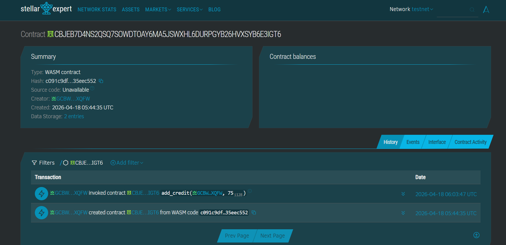
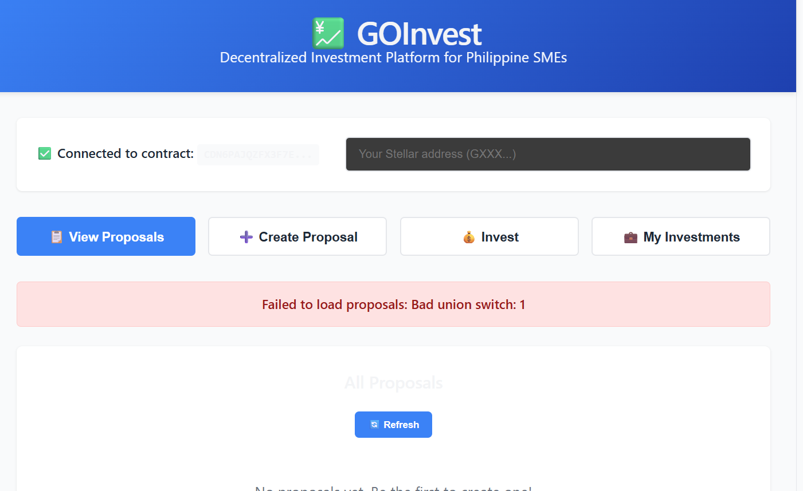
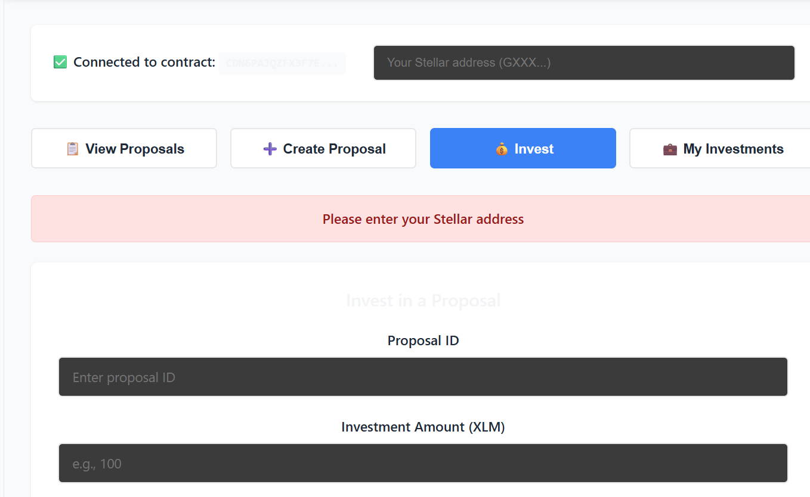

# GOInvest

> Decentralized e-commerce and investment platform for Philippine SMEs, built on the Stellar blockchain using Soroban smart contracts.

---

## Table of Contents

- [Overview](#overview)
- [Architecture](#architecture)
- [Prerequisites](#prerequisites)
- [Getting Started](#getting-started)
  - [Clone the Repository](#clone-the-repository)
  - [Smart Contract](#smart-contract)
  - [Frontend](#frontend)
- [Smart Contract Reference](#smart-contract-reference)
- [Deployment](#deployment)
- [Testing](#testing)
- [Project Structure](#project-structure)
- [Contributing](#contributing)
- [License](#license)

---

## Overview

**GOInvest** is an e-commerce and investment platform designed to democratize funding for small and medium enterprises (SMEs). The platform allows small businesses to propose funding ideas and secure capital directly from individual investors — removing the informational and technical barriers of traditional investment.

Key capabilities:

- **Proposal Submission** — SMEs create on-chain funding proposals with a title, description, and goal amount denominated in XLM.
- **Direct Investment** — Individual investors fund proposals directly, with contributions tracked per-investor on-chain.
- **Automated Goal Management** — Proposals are automatically closed when their funding goal is reached.
- **Freighter Wallet Integration** — Users interact with the platform via their Freighter browser extension wallet, enabling secure Stellar-based asset management without exposing private keys.
- **Stellar Testnet Support** — Fully deployable to the Stellar testnet for development and demonstration purposes.

Built during the **Stellar Philippines UniTour** bootcamp in partnership with [Rise In](https://risein.com).

---

## Architecture

```
Stellar-Repo/
├── contract/               # Soroban smart contract (Rust)
│   ├── src/
│   │   ├── lib.rs          # Contract logic
│   │   └── test.rs         # Unit tests
│   └── Cargo.toml
└── goinvest-frontend/      # React frontend (Vite)
    ├── src/
    │   ├── App.jsx         # Main application component
    │   ├── utils/          # Soroban SDK helpers
    │   └── config/         # Network and contract config
    ├── index.html
    └── package.json
```

**Tech Stack:**

| Layer | Technology |
|---|---|
| Smart Contract | Rust, Soroban SDK v22 |
| Blockchain | Stellar Testnet |
| Frontend | React 19, Vite 8 |
| Wallet | Freighter Browser Extension |
| Deployment | Stellar CLI |

---

## Prerequisites

Ensure the following tools are installed before proceeding:

- [Rust](https://rustup.rs/) (stable toolchain)
- WASM compilation target:
  ```bash
  rustup target add wasm32-unknown-unknown
  ```
- [Stellar CLI](https://developers.stellar.org/docs/tools/stellar-cli):
  ```bash
  cargo install --locked stellar-cli
  ```
- [Node.js](https://nodejs.org/) v18+
- [Freighter Wallet](https://freighter.app/) browser extension, configured on **Testnet**

---

## Getting Started

### Clone the Repository

```bash
git clone https://github.com/mave-o/Stellar-Repo.git
cd Stellar-Repo
```

### Smart Contract

```bash
cd contract

# Run tests
cargo test

# Build for deployment
cargo build --target wasm32-unknown-unknown --release
```

### Frontend

```bash
cd goinvest-frontend

# Install dependencies
npm install

# Start development server
npm run dev
```

The app will be available at `http://localhost:5173`.

---

## Smart Contract Reference

The `GOInvestContract` exposes the following callable functions:

### `submit_proposal`

Registers a new funding proposal on-chain.

| Parameter | Type | Description |
|---|---|---|
| `owner` | `Address` | The SME's Stellar address |
| `title` | `String` | Proposal title |
| `description` | `String` | Short business description |
| `goal_amount` | `i128` | Funding goal in stroops (1 XLM = 10,000,000 stroops) |

**Returns:** `u64` — the new proposal ID.

---

### `invest`

Records an investment from an individual investor into a proposal.

| Parameter | Type | Description |
|---|---|---|
| `investor` | `Address` | Investor's Stellar address |
| `proposal_id` | `u64` | Target proposal ID |
| `amount` | `i128` | Investment amount in stroops |

**Behavior:** Proposal is automatically marked inactive once `raised_amount >= goal_amount`.

---

### `get_proposal`

Retrieves a single proposal by ID.

**Returns:** `Proposal` struct containing `id`, `owner`, `title`, `description`, `goal_amount`, `raised_amount`, `is_active`.

---

### `get_proposal_count`

Returns the total number of proposals submitted.

---

### `get_investment`

Returns the total amount a specific investor has contributed to a given proposal.

| Parameter | Type |
|---|---|
| `proposal_id` | `u64` |
| `investor` | `Address` |

**Returns:** `i128` (in stroops)

---

## Deployment

### 1. Generate a Testnet Identity

```bash
stellar keys generate --global my-key --network testnet
stellar keys address my-key
```

### 2. Fund the Account

```bash
stellar keys fund my-key --network testnet
```

Or via Friendbot:
```bash
curl "https://friendbot.stellar.org?addr=<YOUR_ADDRESS>"
```

### 3. Deploy the Contract

```bash
stellar contract deploy \
  --wasm target/wasm32-unknown-unknown/release/goinvest.wasm \
  --source my-key \
  --network testnet
```

Copy the returned **Contract ID** (starts with `C...`).

### 4. Verify on Stellar Expert

```
https://stellar.expert/explorer/testnet/contract/<YOUR_CONTRACT_ID>
```

---

## Testing

The contract includes 5 unit tests covering:

| # | Test | Description |
|---|---|---|
| 1 | `test_submit_proposal` | Happy path — proposal created successfully |
| 2 | `test_invest_zero_amount_fails` | Edge case — zero investment panics |
| 3 | `test_investment_updates_raised_amount` | State — raised amount increments correctly |
| 4 | `test_proposal_closes_when_goal_reached` | Lifecycle — proposal closes at 100% funding |
| 5 | `test_get_investment_returns_correct_amount` | Tracking — individual investment amounts are accurate |

Run all tests:

```bash
cd contract
cargo test
```
## Contract

Deployed on Stellar testnet:

```
CDN6PAJQZFX3F7EVNQN7B4A3HFDJNMVOONFEHKSXSV7DKBHFIBZWH7MZ
```

---


## Project Structure

```
contract/
└── src/
    ├── lib.rs        # Contract entry point, storage keys, data types, function implementations
    └── test.rs       # All unit tests using soroban-sdk testutils

goinvest-frontend/
└── src/
    ├── App.jsx       # Root component — wallet connection, proposal views, forms
    ├── utils/        # Stellar/Soroban interaction helpers (soroban.js)
    └── config/       # Contract address and network configuration
```

---

## Project Demo





---

## Contributing

1. Fork the repository
2. Create a feature branch: `git checkout -b feature/your-feature`
3. Commit your changes: `git commit -m "feat: add your feature"`
4. Push to your branch: `git push origin feature/your-feature`
5. Open a Pull Request

Please ensure `cargo test` passes and `npm run lint` reports no errors before submitting.

---

## License

This project was developed as part of the **Stellar Philippines UniTour** bootcamp powered by [Rise In](https://risein.com).  
Smart contract source code is open for educational use.

---

*Built with ❤️ on Stellar | Powered by Soroban*
